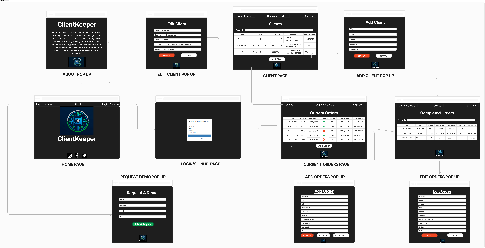

# ClientKeeper Design

## 1. Problem Statement

ClientKeeper is a service designed for small businesses, offering a suite of tools to efficiently manage client information and orders. It ensures the accuracy of client data while providing tracking capabilities for order purchases, shipping progress, and revenue generation. This platform is tailored to enhance business operations, enabling users to focus on growth and customer satisfaction.
## 2. Top Questions to Resolve in Review

_List the most important questions you have about your design, or things that you are still debating internally that you might like help working through._

1. Does my current table design ensure that table data will NOT be shown for all users and only the logged-in user?
2. Verify I formatted correctly for each endpoint needing to go to email first. If true do I need a `userNotFoundException` on every endpoint?

## 3. Use Cases

_This is where we work backwards from the customer and define what our customers would like to do (and why). You may also include use cases for yourselves (as developers), or for the organization providing the product to customers._

U1. As a ClientKeeper user, I want to add a new client with name, email, phone number,  address, and date became a client.

U2. As a ClientKeeper user, I want to view a list of all clients.

U3. As a ClientKeeper user, I want to edit information for current clients.

U4. As a ClientKeeper user, I want to delete a client.

U5. As a ClientKeeper user, I want to view orders for a client.

U6. As a ClientKeeper user, I want to input an order from a client with name of item, cost of item,  and date purchased.

U7. As a ClientKeeper user, I want to leave notes about clients.

U8. As a ClientKeeper user, I want to input shipping information with date ordered, delivery service used, tracking number, expected delivery date, and date delivered.

U9. As a ClientKeeper user, I want to view a calendar with upcoming expected delivery dates.

U10. As a ClientKeeper user, I want to add tags to clients about the type of purchases they make.

U11. As a ClientKeeper user, I want to keep track of money made from purchases sold.

U12. As a ClientKeeper user, I want to keep track of shipping costs.

## 4. Project Scope

### 4.1. In Scope

* Add a new client
* View a list of clients
* Edit client information
* Delete a client
* Search clients
* view all clients
* View orders 
* Input orders
* Input shipping information
* Search orders 
* View all orders 


### 4.2. Out of Scope

* Leave notes for a client
* Securely store payment information
* View a calendar with upcoming expected delivery dates
* Add tags to clients about the type of purchases
* Add tags to purchases
* Keep track of money made from purchases sold
* Keep track of shipping costs

# 5. Proposed Architecture Overview

### 1. User Interface

   1. **Home Page** - Request a demo, About, Login/Signup, Social Media Links
   2. **Request A Demo Pop-Up** - Form to submit for a demo. Asks for name, email, business name, and phone number. Form submits an email to the ClientKeeper email address.
   3. **About Pop-Up** - A pop-up page that gives general information about the ClientKeeper service.
   4. **Login/Signup** - Amazon Cognito 
   5. **Current Orders Page** - Table that shows current orders. Each order includes client name, order number, date purchased, whether item has shipped, shipping service, expected delivery date, and tracking number. 
   6. **Completed Orders Page** - This page shows all completed orders. It has a search function to find a particular order. In addition, there is a table that includes the client name, item purchased, order number, date purchased, date delivered, service used, and what website the purchase generated from (this function allows the user to keep track of which sites advertised are prdoucing the most revenue).
   7. **Add Orders Pop-Up** - A pop-up page that allows users to enter information for new orders. 
   8. **Edit Orders Pop-Up** - A pop-up page that allows users to edit information for existing orders. 
   9. **Client Page** - This page shows all clients. It has a search function to find a particular client. In addition, there is a table that includes the client name, email address, phone number, address, and date they became a client. 
   10. **Add Client Pop-Up** - A pop-up page that allows users to enter information for new clients.
   11. **Edit Client Pop-Up** - A pop-up page that allows users to edit information for existing clients.

### 2. API Gateway and Lambda

1. Api Gateway and Lambda are the REST component in our system design. API Gateway is the entry point for all requests, and it acts as an HTTP endpoint that routes requests to Lambda. After processing a request, Lambda returns the appropriate response.

### 3. Database 

1. DynamoDB stores and manages client and order information.
2. We implement a DAO to encapsulate communication with our DynamoDB tables.
   1. Handles interactions with the DynamoDB tables such as creating, querying, updating, and deleting both clients and orders.
3. DynamoDB model classes represent the data as it will be stored in and retrieved from DynamoDB tables.

### 4. Activity Classes & Models

1. Activity classes have several functions such as managing the logic for user interactions, perform validations, and invoke DAOs to retrieve/update data.
2. Each Activity class handles a particular aspect of functionality.
3. To manage data as it flows through our business logic, we use models that can be easily modified without needing significant changes to the Activity classes.

### 5. Search and Pagination

1. This will handle how we search through the clients/orders and paginate the results.

# 6. API

## 6.1. Public Models

```
// ClientModel

String clientId;
String clientName;
String clientPhone;
String clientAddress;
String clientEmail;
String clientMemberSince;

```

```
// OrderModel

String clientId;
String orderId;
String item;
Boolean shipped;
String purchaseDate;
String shippingService;
String expectedDate;
String deliveredDate;
String trackingNumber;
String reference;

```

## 6.2. Create Client Endpoint 

* Accepts `POST` requests to `/clients`
* Accepts a provided `clientName`, `clientEmail`, `clientPhone`, `clientAddress`, `clientMemberSince`, and a `clientId` given by 
ClientKeeper. Returns the new client.
  * For security concerns, we will validate the provided `clientMemberSince` is in the proper format according to *[time.java](https://docs.oracle.com/javase/8/docs/api/java/time/Month.html)*.
    If incorrect, will throw an `InvalidDateException`.
  * If the required data is missing, will throw an `InvalidAttributeValueException`.
  
## 6.4. Get Client Endpoint 

* Accepts `GET` requests to `/clients/:clientId`
* Accepts a `clientId` and returns the client. 
  * If the given `clientId` is not found will throw a `ClientNotFoundException`.

## 6.5 Get All Clients Endpoint 
* Accepts `GET` requests to `/clients`
* Returns a list of clients for the user.

## 6.6. Edit Client Endpoint 

* Accepts `PUT` requests to `/clients/:clientId`
* Accepts data to update a client's information and returns the updated client. 
  * If the given `clientId` is not found will throw a `ClientNotFoundException`.
  * If the provided data contains invalid values, will throw an `InvalidAttributeValueException`.

## 6.7. Delete Client Endpoint

* Accepts `DELETE` requests to `/clients/:clientId`
* Accepts a `clientId` and deletes. 
  * If the given `clientId` is not found will throw a `ClientNotFoundException`.
  
## 6.8. Create Order Endpoint

* Accepts `POST` requests to `/orders`
* Accepts a provided `clientId`, `item`, `purchaseDate`, `shippingService`, `expectedDate`, `deliveredDate`,
`trackingNumber`, `reference`, and a `orderId` given by ClientKeeper. 
  * For security concerns, we will validate the provided `purchaseDate`, `expectedDate`, and `deliveredDate` is in the proper format according to *[time.java](https://docs.oracle.com/javase/8/docs/api/java/time/Month.html)*.
    If incorrect, will throw an `InvalidDateException`.
  * If the required data is missing, will throw an `InvalidAttributeValueException`.

## 6.9. Get Order Endpoint

* Accepts `GET` requests to `/orders/:orderId`
* Accepts a `orderId` and returns the order.
  * If the given `orderId` is not found will throw a `OrderNotFoundException`.

## 6.10. Edit Order Endpoint

* Accepts `PUT` requests to `/orders/:orderId`
* Accepts data to update an orders information and returns the updated order.
  * If the given `orderId` is not found will throw a `OrderNotFoundException`.
  * If the provided data contains invalid values, will throw an `InvalidAttributeValueException`.

## 6.11. Delete Order Endpoint 

* Accepts `DELETE` requests to `/orders/:orderId`
* Accepts `orderId` and deletes.
  * If the given `orderId` is not found will throw a `ClientNotFoundException`.

## 6.12. Get Undelivered Orders Endpoint 

* Accepts `GET` requests to `/orders/undelivered`
* Accepts an empty `delivered date` and returns orders. 

## 6.13. Get Delivered Orders Endpoint 

* Accepts `GET` requests to `/orders/delivered`
* Accepts `delivered date` and returns orders. 

## 6.14. Get Orders By Client Id Endpoint 

* Accepts `GET` requests to `/orders/byClientId/{clientId}`
* Accepts a clientId as a path parameter and returns a list of orders associated with that client ID.
* If the given clientId is not found, it will return an empty list.
  
# 7. Tables

### 7.1. `clients`

```
userEmail // partition key, string
clientId // sort key, string
clientName // string
clientEmail // string
clientPhone // string
clientAddress // string
clientMemberSince // string
```

### 7.2. `orders`

```
userEmail // partition key, string
orderId // sort key, string
clientId // string
item // string
shipped // boolean
purchaseDate // string
shippingService // string
expectedDate // string
deliveredDate // string
trackingNumber // string
reference // string
```

### 7.4. `ClientOrdersIndex (GSI)`

```
clientId // partition key, string
```

- `ClientOrdersIndex` includes ALL attributes from the `orders` table

# 8. Pages
